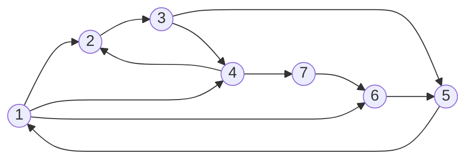

# Estrutura dos nós
Todos os nós armazenam:
- X arquivos.
- Y vizinhos.

Todos os nós devem ser capaz de se comunicar por meio dos vizinhos.

# Solução 1 - Varredura com id de objetivo
Nessa solução, levamos em consideração que na empresa existem dois sistemas. 
Um para compartilhamento de arquivos, que seria o que estamos desenvolvendo.
E outro sistema para comunicação, como Email, Slack, etc.

Nesse caso, o sistema de compartilhamento de arquivos não precisaria ter acesso
à lista global de arquivos do sistema, seja ela por um servidor centralizado, ou
por uma varredura periódica na rede toda em busca da lista atualizada de arquivos.
